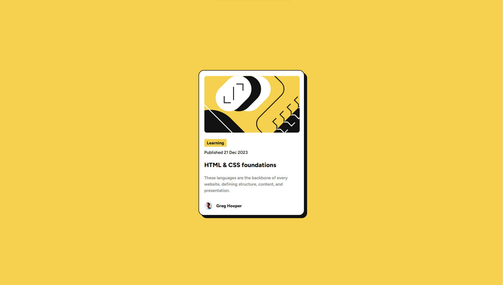
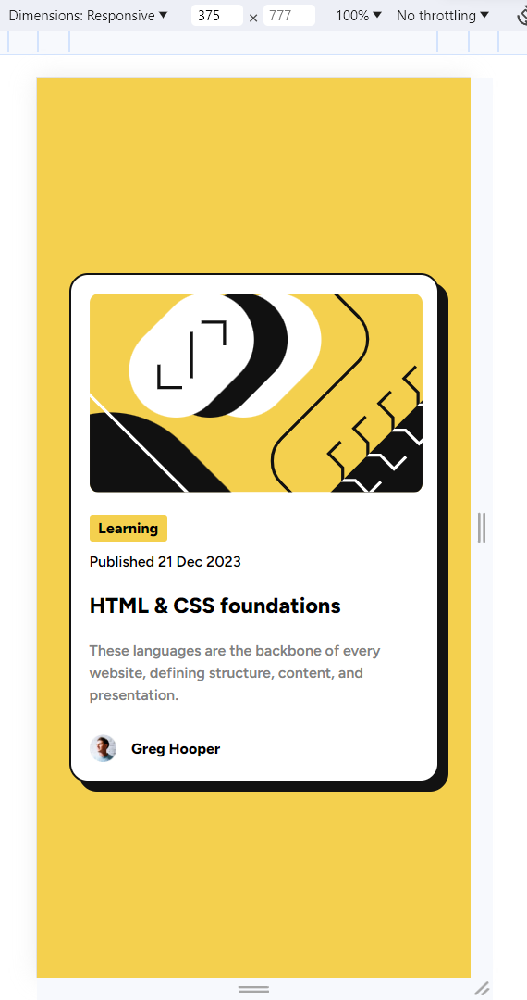

# Frontend Mentor - Blog preview card solution

This is a solution to the [Blog preview card challenge on Frontend Mentor](https://www.frontendmentor.io/challenges/blog-preview-card-ckPaj01IcS). Frontend Mentor challenges help you improve your coding skills by building realistic projects.

## Table of contents

- [Overview](#overview)
  - [The challenge](#the-challenge)
  - [Screenshot](#screenshot)
  - [Links](#links)
- [My process](#my-process)
  - [Built with](#built-with)
  - [What I learned](#what-i-learned)
  - [Continued development](#continued-development)
- [Author](#author)

**Note: Delete this note and update the table of contents based on what sections you keep.**

## Overview

### The challenge

Users should be able to:

- See hover and focus states for all interactive elements on the page

### Screenshot

### Desktop View

### Desktop View (with Active state)

Active state changes include increased card shadow when hovered on card and highlight of text and change in cursor to pointer when hovered on the card title.

### Mobile View

### Links

- Solution URL: [Add solution URL here](https://your-solution-url.com)
- Live Site URL: [View live site](https://lively-phoenix-7a9ab6.netlify.app/)

## My process

### Built with

- Semantic HTML5 markup
- CSS custom properties
- Flexbox

### What I learned

I gained confidence in laying out page components (card and the details inside the card) and was able to do it easily compared to previous attempts.

### Continued development

I will continue further focusing response web design skills.

## Author

- GitHub - [sh4rdu1-git](https://github.com/sh4rdu1-git)
- Frontend Mentor - [@sh4rdu1-git](https://www.frontendmentor.io/profile/sh4rdu1-git)
