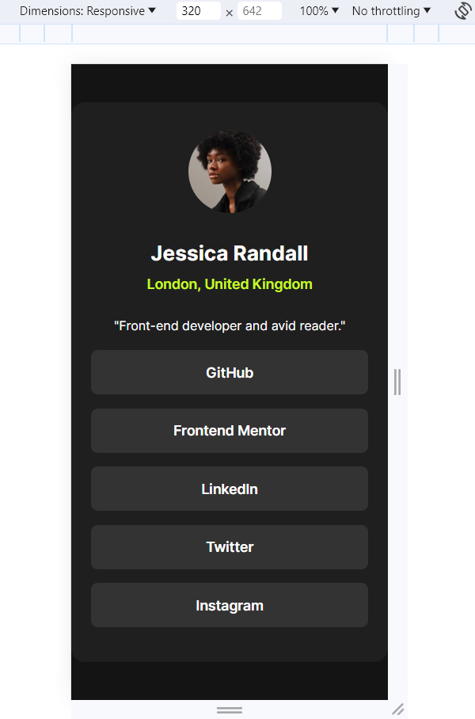

# Frontend Mentor - Social links profile solution

This is a solution to the [Social links profile challenge on Frontend Mentor](https://www.frontendmentor.io/challenges/social-links-profile-UG32l9m6dQ). Frontend Mentor challenges help you improve your coding skills by building realistic projects.

## Table of contents

- [Overview](#overview)
  - [The challenge](#the-challenge)
  - [Screenshot](#screenshot)
  - [Links](#links)
- [My process](#my-process)
  - [Built with](#built-with)
  - [What I learned](#what-i-learned)
  - [Continued development](#continued-development)
- [Author](#author)

**Note: Delete this note and update the table of contents based on what sections you keep.**

## Overview

### The challenge

Users should be able to:

- See hover and focus states for all interactive elements on the page

## Screenshot

### Desktop View


### Mobile View



### Links

- Solution URL: [Add solution URL here](https://your-solution-url.com)
- Live Site URL: [Add live site URL here](https://gregarious-kleicha-2b5da5.netlify.app/)

## My process

### Built with

- Semantic HTML5 markup
- CSS custom properties
- Flexbox

### What I learned

Through ths challenge, I was able to learn how to structure HTML markup for diffecrent sections of the page. I have tried using semantic HTML tags for defining elements of the page. For styling the page, I have used plain CSS and used Flexbox for the arrangement. For the effect on hovering the mouse pointer on a button, I used `:hover` CSS pseudo-class.

```css
.link a {
  color: var(--color-white);
  text-decoration: none;
  font-weight: 600;
}

.link:hover a {
  color: var(--color-darkgrey);
}
```

### Continued development

I want to continue improving my responsive design skills and get comfortable with different CSS units used for the spacing and styling.

## Author

- GitHub - [sh4rdu1-git](https://www.github.com/sh4rdu1-git)
- Frontend Mentor - [@sh4rdu1-git](https://www.frontendmentor.io/profile/sh4rdu1-git)
